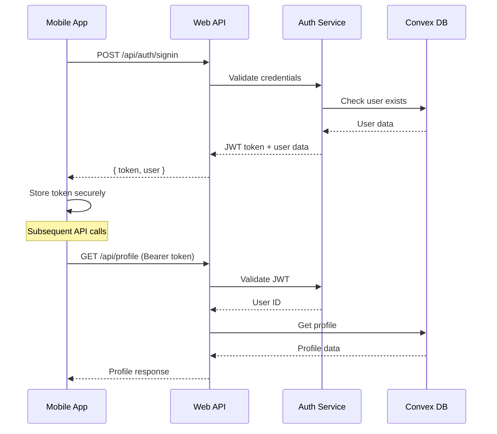
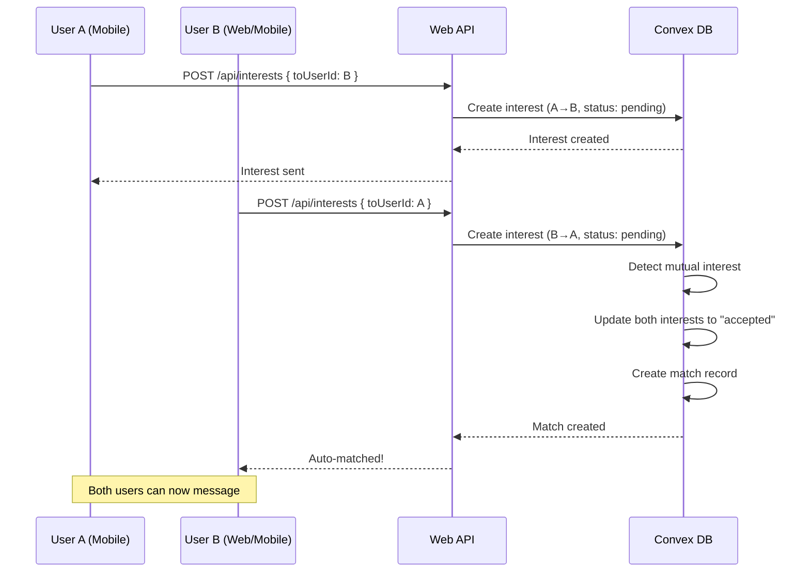
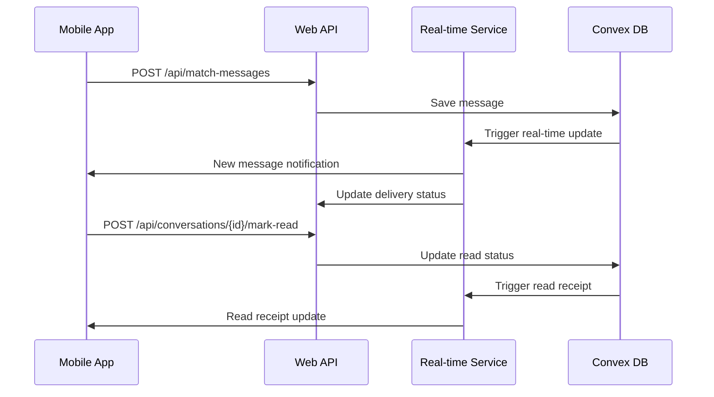

# Aroosi Mobile - Main Project Alignment Design Document

## Overview

This design document outlines the comprehensive alignment of the Aroosi Mobile application with the main Aroosi web application. The alignment encompasses authentication system migration, API integration, feature parity, and data model consistency to ensure a unified user experience across both platforms.

## Architecture

### Current State Analysis

**Main Aroosi Web Application:**
- Custom JWT-based authentication system
- Next.js 15 with React 19
- Convex real-time database
- Custom AuthProvider with JWT token management
- Unified API endpoints under `/api/*`
- Real-time features with WebSocket/SSE

**Current Aroosi Mobile Application:**
- Clerk authentication (outdated)
- React Native with Expo
- API client pointing to web app endpoints
- Separate authentication context
- Mixed API integration patterns

### Target Architecture

```
Aroosi Mobile App
├── Authentication Layer (Custom JWT - aligned with web)
├── API Client Layer (Unified with web endpoints)
├── Data Layer (Shared models and validation)
├── Feature Layer (Parity with web features)
├── Real-time Layer (Synchronized with web)
└── UI Layer (Mobile-optimized, feature-complete)

Backend Integration:
Mobile App → Web App API → Convex Database
```

## Components and Interfaces

### 1. Authentication System Migration

**Current Implementation:**
```typescript
// Using Clerk
const { isSignedIn, userId, getToken } = useClerkAuth();
```

**Target Implementation:**
```typescript
// Custom JWT system aligned with web
interface AuthContextType {
  user: User | null;
  isLoading: boolean;
  isAuthenticated: boolean;
  token: string | null;
  signIn: (email: string, password: string) => Promise<AuthResult>;
  signUp: (email: string, password: string, firstName: string, lastName: string) => Promise<AuthResult>;
  verifyOTP: (email: string, otp: string) => Promise<AuthResult>;
  signInWithGoogle: (credential: string) => Promise<AuthResult>;
  signOut: () => void;
  refreshUser: () => Promise<void>;
  getToken: (forceRefresh?: boolean) => Promise<string | null>;
}
```

**Migration Strategy:**
1. Replace Clerk dependencies with custom authentication
2. Implement secure token storage using Expo SecureStore
3. Add OTP verification flow for mobile
4. Integrate Google OAuth for mobile
5. Maintain backward compatibility during transition

### 2. API Client Unification

**Current API Client Structure:**
```typescript
class ApiClient {
  private baseUrl: string;
  private getToken: (() => Promise<string | null>) | null = null;
  
  // Mixed endpoint patterns
  async getProfile(): Promise<ApiResponse<Profile>>
  async sendInterest(toUserId: string, fromUserId: string)
}
```

**Target Unified API Client:**
```typescript
class UnifiedApiClient {
  private baseUrl: string;
  private authProvider: AuthProvider;
  
  // Standardized endpoint patterns matching web app
  async getProfile(): Promise<ApiResponse<Profile>>
  async updateProfile(updates: Partial<Profile>): Promise<ApiResponse<Profile>>
  async searchProfiles(filters: SearchFilters, page: number): Promise<SearchResponse>
  async sendInterest(toUserId: string): Promise<InterestResponse>
  async getMessages(conversationId: string, options?: MessageOptions): Promise<MessageResponse>
  async sendMessage(data: MessageData): Promise<MessageResponse>
  async uploadProfileImage(imageData: ImageUploadData): Promise<ImageResponse>
  async getSubscriptionStatus(): Promise<SubscriptionResponse>
  async purchaseSubscription(data: PurchaseData): Promise<PurchaseResponse>
}
```

### 3. Data Model Alignment

**Profile Data Model:**
```typescript
interface Profile {
  id: string;
  userId: string;
  fullName: string;
  dateOfBirth: string;
  gender: "male" | "female" | "other";
  profileFor: string;
  phoneNumber: string;
  email: string;
  
  // Location & Physical
  country: string;
  city: string;
  height: string;
  maritalStatus: string;
  physicalStatus: string;
  
  // Cultural & Lifestyle
  motherTongue?: string;
  religion?: string;
  ethnicity?: string;
  diet?: string;
  smoking?: string;
  drinking?: string;
  
  // Education & Career
  education?: string;
  occupation?: string;
  annualIncome?: string;
  aboutMe?: string;
  
  // Partner Preferences
  preferredGender: string;
  partnerPreferenceAgeMin: number;
  partnerPreferenceAgeMax?: number;
  partnerPreferenceCity: string[];
  
  // Profile Status
  isProfileComplete: boolean;
  isOnboardingComplete: boolean;
  isActive: boolean;
  
  // Subscription
  subscriptionPlan: "free" | "premium" | "premiumPlus";
  subscriptionExpiresAt?: number;
  
  // Images
  profileImageIds: string[];
  profileImageUrls: string[];
  
  // Timestamps
  createdAt: number;
  updatedAt: number;
}
```

**Interest Data Model (Aligned with Auto-Matching):**
```typescript
interface Interest {
  _id: string;
  fromUserId: string;
  toUserId: string;
  status: "pending" | "accepted" | "rejected";
  createdAt: number;
  updatedAt: number;
  
  // Profile enrichment (from main project)
  fromProfile?: ProfileSummary;
  toProfile?: ProfileSummary;
}

interface ProfileSummary {
  fullName: string;
  city: string;
  profileImageIds: string[];
  profileImageUrls: string[];
}
```

**Message Data Model:**
```typescript
interface Message {
  _id: string;
  conversationId: string;
  fromUserId: string;
  toUserId: string;
  text: string;
  type?: "text" | "voice" | "image";
  createdAt: number;
  readAt?: number;
  
  // Voice message fields
  audioStorageId?: string;
  duration?: number;
  fileSize?: number;
  mimeType?: string;
  
  // Image message fields
  imageStorageId?: string;
  imageUrl?: string;
  
  // Delivery tracking
  deliveredAt?: number;
  status: "sent" | "delivered" | "read";
}
```

### 4. Feature Alignment Components

#### Search and Discovery
```typescript
interface SearchFilters {
  gender?: "male" | "female" | "other";
  ageMin?: number;
  ageMax?: number;
  ukCity?: string[];
  maritalStatus?: string[];
  education?: string[];
  occupation?: string[];
  diet?: string[];
  smoking?: string[];
  drinking?: string[];
  
  // Premium filters (Premium Plus only)
  annualIncomeMin?: number;
  heightMin?: string;
  heightMax?: string;
}

interface SearchResponse {
  profiles: Profile[];
  totalCount: number;
  hasMore: boolean;
  nextPage?: number;
}
```

#### Interest System (Auto-Matching)
```typescript
interface InterestManager {
  sendInterest(toUserId: string): Promise<InterestResponse>;
  removeInterest(toUserId: string): Promise<InterestResponse>;
  getSentInterests(): Promise<Interest[]>;
  getReceivedInterests(): Promise<Interest[]>;
  getMatches(): Promise<Match[]>;
  checkInterestStatus(fromUserId: string, toUserId: string): Promise<InterestStatus>;
}

interface Match {
  _id: string;
  participants: string[];
  createdAt: number;
  lastMessageAt?: number;
  conversationId: string;
  profiles: ProfileSummary[];
}
```

#### Messaging System
```typescript
interface MessagingManager {
  getConversations(): Promise<Conversation[]>;
  getMessages(conversationId: string, options?: MessageOptions): Promise<Message[]>;
  sendTextMessage(conversationId: string, text: string, toUserId: string): Promise<Message>;
  sendVoiceMessage(conversationId: string, audioData: AudioData, toUserId: string): Promise<Message>;
  markMessagesAsRead(conversationId: string): Promise<void>;
  sendTypingIndicator(conversationId: string, action: "start" | "stop"): Promise<void>;
  getTypingIndicators(conversationId: string): Promise<TypingUser[]>;
}
```

#### Subscription Management
```typescript
interface SubscriptionManager {
  getStatus(): Promise<SubscriptionStatus>;
  getUsageStats(): Promise<UsageStats>;
  purchaseSubscription(planId: string, purchaseData: PurchaseData): Promise<PurchaseResult>;
  cancelSubscription(): Promise<CancelResult>;
  restorePurchases(): Promise<RestoreResult>;
  canUseFeature(feature: string): Promise<boolean>;
  trackFeatureUsage(feature: string): Promise<void>;
}
```

## Data Models

### Authentication Flow



### Interest Auto-Matching Flow



### Real-time Messaging Flow



## Error Handling

### Authentication Error Handling

```typescript
interface AuthError {
  code: string;
  message: string;
  details?: any;
}

const AUTH_ERROR_CODES = {
  INVALID_CREDENTIALS: "INVALID_CREDENTIALS",
  EMAIL_NOT_VERIFIED: "EMAIL_NOT_VERIFIED",
  ACCOUNT_LOCKED: "ACCOUNT_LOCKED",
  TOKEN_EXPIRED: "TOKEN_EXPIRED",
  NETWORK_ERROR: "NETWORK_ERROR",
  OTP_INVALID: "OTP_INVALID",
  OTP_EXPIRED: "OTP_EXPIRED",
} as const;

class AuthErrorHandler {
  static handle(error: AuthError): string {
    switch (error.code) {
      case AUTH_ERROR_CODES.INVALID_CREDENTIALS:
        return "Invalid email or password. Please try again.";
      case AUTH_ERROR_CODES.EMAIL_NOT_VERIFIED:
        return "Please verify your email address before signing in.";
      case AUTH_ERROR_CODES.TOKEN_EXPIRED:
        return "Your session has expired. Please sign in again.";
      default:
        return error.message || "An unexpected error occurred.";
    }
  }
}
```

### API Error Handling

```typescript
interface ApiError {
  success: false;
  error: {
    code: string;
    message: string;
    details?: any;
  };
}

const API_ERROR_CODES = {
  UNAUTHORIZED: "UNAUTHORIZED",
  FORBIDDEN: "FORBIDDEN",
  VALIDATION_ERROR: "VALIDATION_ERROR",
  RATE_LIMITED: "RATE_LIMITED",
  SUBSCRIPTION_REQUIRED: "SUBSCRIPTION_REQUIRED",
  PROFILE_INCOMPLETE: "PROFILE_INCOMPLETE",
  NETWORK_ERROR: "NETWORK_ERROR",
} as const;

class ApiErrorHandler {
  static handle(error: ApiError): string {
    switch (error.error.code) {
      case API_ERROR_CODES.SUBSCRIPTION_REQUIRED:
        return "This feature requires a premium subscription.";
      case API_ERROR_CODES.RATE_LIMITED:
        return "Too many requests. Please wait a moment and try again.";
      case API_ERROR_CODES.PROFILE_INCOMPLETE:
        return "Please complete your profile to access this feature.";
      default:
        return error.error.message || "An error occurred. Please try again.";
    }
  }
}
```

## Testing Strategy

### Authentication Testing

```typescript
describe("Authentication System", () => {
  test("should sign in with valid credentials", async () => {
    const result = await authService.signIn("test@example.com", "password");
    expect(result.success).toBe(true);
    expect(result.token).toBeDefined();
  });

  test("should handle invalid credentials", async () => {
    const result = await authService.signIn("test@example.com", "wrong");
    expect(result.success).toBe(false);
    expect(result.error).toBe("INVALID_CREDENTIALS");
  });

  test("should verify OTP correctly", async () => {
    const result = await authService.verifyOTP("test@example.com", "123456");
    expect(result.success).toBe(true);
  });
});
```

### API Integration Testing

```typescript
describe("API Client", () => {
  test("should fetch profile with valid token", async () => {
    const response = await apiClient.getProfile();
    expect(response.success).toBe(true);
    expect(response.data).toHaveProperty("fullName");
  });

  test("should handle unauthorized requests", async () => {
    apiClient.setToken(null);
    const response = await apiClient.getProfile();
    expect(response.success).toBe(false);
    expect(response.error.code).toBe("UNAUTHORIZED");
  });
});
```

### Feature Parity Testing

```typescript
describe("Interest System", () => {
  test("should send interest successfully", async () => {
    const response = await interestManager.sendInterest("user123");
    expect(response.success).toBe(true);
  });

  test("should auto-match when mutual interest", async () => {
    await interestManager.sendInterest("user123");
    // Simulate other user sending interest back
    const matches = await interestManager.getMatches();
    expect(matches.length).toBeGreaterThan(0);
  });
});
```

## Security Considerations

### Token Management

```typescript
class SecureTokenManager {
  private static readonly TOKEN_KEY = "auth_token";
  private static readonly REFRESH_KEY = "refresh_token";

  static async storeTokens(token: string, refreshToken?: string): Promise<void> {
    await SecureStore.setItemAsync(this.TOKEN_KEY, token);
    if (refreshToken) {
      await SecureStore.setItemAsync(this.REFRESH_KEY, refreshToken);
    }
  }

  static async getToken(): Promise<string | null> {
    return await SecureStore.getItemAsync(this.TOKEN_KEY);
  }

  static async clearTokens(): Promise<void> {
    await SecureStore.deleteItemAsync(this.TOKEN_KEY);
    await SecureStore.deleteItemAsync(this.REFRESH_KEY);
  }

  static async refreshToken(): Promise<string | null> {
    const refreshToken = await SecureStore.getItemAsync(this.REFRESH_KEY);
    if (!refreshToken) return null;

    try {
      const response = await fetch("/api/auth/refresh", {
        method: "POST",
        headers: { "Content-Type": "application/json" },
        body: JSON.stringify({ refreshToken }),
      });

      const data = await response.json();
      if (data.success) {
        await this.storeTokens(data.token, data.refreshToken);
        return data.token;
      }
    } catch (error) {
      console.error("Token refresh failed:", error);
    }

    return null;
  }
}
```

### Data Validation

```typescript
class DataValidator {
  static validateProfile(profile: any): ValidationResult {
    const errors: string[] = [];

    if (!profile.fullName || profile.fullName.length < 2) {
      errors.push("Full name must be at least 2 characters");
    }

    if (!profile.email || !this.isValidEmail(profile.email)) {
      errors.push("Valid email address is required");
    }

    if (!profile.dateOfBirth || !this.isValidAge(profile.dateOfBirth)) {
      errors.push("Must be at least 18 years old");
    }

    return {
      isValid: errors.length === 0,
      errors,
      data: errors.length === 0 ? profile : null,
    };
  }

  private static isValidEmail(email: string): boolean {
    return /^[^\s@]+@[^\s@]+\.[^\s@]+$/.test(email);
  }

  private static isValidAge(dateOfBirth: string): boolean {
    const age = new Date().getFullYear() - new Date(dateOfBirth).getFullYear();
    return age >= 18;
  }
}
```

## Performance Optimizations

### Caching Strategy

```typescript
class CacheManager {
  private static cache = new Map<string, CacheEntry>();

  static async get<T>(key: string): Promise<T | null> {
    const entry = this.cache.get(key);
    if (!entry || this.isExpired(entry)) {
      this.cache.delete(key);
      return null;
    }
    return entry.data as T;
  }

  static async set<T>(key: string, data: T, ttl: number = 300000): Promise<void> {
    this.cache.set(key, {
      data,
      expiresAt: Date.now() + ttl,
    });
  }

  private static isExpired(entry: CacheEntry): boolean {
    return Date.now() > entry.expiresAt;
  }
}
```

### Image Optimization

```typescript
class ImageOptimizer {
  static async optimizeForUpload(imageUri: string): Promise<OptimizedImage> {
    const manipulatedImage = await ImageManipulator.manipulateAsync(
      imageUri,
      [
        { resize: { width: 1080 } }, // Max width 1080px
      ],
      {
        compress: 0.8,
        format: ImageManipulator.SaveFormat.JPEG,
      }
    );

    return {
      uri: manipulatedImage.uri,
      width: manipulatedImage.width,
      height: manipulatedImage.height,
      size: await this.getFileSize(manipulatedImage.uri),
    };
  }

  private static async getFileSize(uri: string): Promise<number> {
    const fileInfo = await FileSystem.getInfoAsync(uri);
    return fileInfo.exists ? fileInfo.size || 0 : 0;
  }
}
```

## Integration Points

### Real-time Integration

```typescript
class RealtimeManager {
  private eventSource: EventSource | null = null;
  private reconnectAttempts = 0;
  private maxReconnectAttempts = 5;

  async connect(token: string): Promise<void> {
    const url = `${API_BASE_URL}/api/realtime/events?token=${token}`;
    
    this.eventSource = new EventSource(url);
    
    this.eventSource.onmessage = (event) => {
      const data = JSON.parse(event.data);
      this.handleRealtimeEvent(data);
    };

    this.eventSource.onerror = () => {
      this.handleConnectionError();
    };
  }

  private handleRealtimeEvent(event: RealtimeEvent): void {
    switch (event.type) {
      case "new_message":
        this.notifyNewMessage(event.data);
        break;
      case "new_match":
        this.notifyNewMatch(event.data);
        break;
      case "typing_indicator":
        this.updateTypingIndicator(event.data);
        break;
    }
  }

  private async handleConnectionError(): Promise<void> {
    if (this.reconnectAttempts < this.maxReconnectAttempts) {
      this.reconnectAttempts++;
      const delay = Math.pow(2, this.reconnectAttempts) * 1000;
      setTimeout(() => this.reconnect(), delay);
    }
  }
}
```

### Push Notification Integration

```typescript
class PushNotificationManager {
  static async initialize(): Promise<void> {
    const { status } = await Notifications.requestPermissionsAsync();
    if (status !== "granted") {
      console.warn("Push notification permissions not granted");
      return;
    }

    const token = await Notifications.getExpoPushTokenAsync();
    await this.registerToken(token.data);
  }

  private static async registerToken(token: string): Promise<void> {
    try {
      await apiClient.registerForPushNotifications({
        playerId: token,
        deviceType: Platform.OS,
      });
    } catch (error) {
      console.error("Failed to register push token:", error);
    }
  }

  static setupNotificationHandlers(): void {
    Notifications.setNotificationHandler({
      handleNotification: async () => ({
        shouldShowAlert: true,
        shouldPlaySound: true,
        shouldSetBadge: true,
      }),
    });

    Notifications.addNotificationReceivedListener(this.handleNotificationReceived);
    Notifications.addNotificationResponseReceivedListener(this.handleNotificationResponse);
  }

  private static handleNotificationReceived(notification: Notification): void {
    // Handle foreground notifications
    console.log("Notification received:", notification);
  }

  private static handleNotificationResponse(response: NotificationResponse): void {
    // Handle notification taps
    const { data } = response.notification.request.content;
    if (data.type === "new_message") {
      // Navigate to conversation
      NavigationService.navigate("Conversation", { conversationId: data.conversationId });
    }
  }
}
```

## Deployment Considerations

### Environment Configuration

```typescript
interface EnvironmentConfig {
  API_BASE_URL: string;
  GOOGLE_CLIENT_ID: string;
  ONESIGNAL_APP_ID: string;
  STRIPE_PUBLISHABLE_KEY: string;
  SENTRY_DSN?: string;
  ENVIRONMENT: "development" | "staging" | "production";
}

const getEnvironmentConfig = (): EnvironmentConfig => {
  const env = process.env.NODE_ENV || "development";
  
  return {
    API_BASE_URL: process.env.EXPO_PUBLIC_API_URL || "https://www.aroosi.app/api",
    GOOGLE_CLIENT_ID: process.env.EXPO_PUBLIC_GOOGLE_CLIENT_ID!,
    ONESIGNAL_APP_ID: process.env.EXPO_PUBLIC_ONESIGNAL_APP_ID!,
    STRIPE_PUBLISHABLE_KEY: process.env.EXPO_PUBLIC_STRIPE_PUBLISHABLE_KEY!,
    SENTRY_DSN: process.env.EXPO_PUBLIC_SENTRY_DSN,
    ENVIRONMENT: env as any,
  };
};
```

### Build Configuration

```typescript
// app.config.ts
export default {
  expo: {
    name: "Aroosi",
    slug: "aroosi-mobile",
    version: "1.0.0",
    orientation: "portrait",
    icon: "./assets/icon.png",
    userInterfaceStyle: "light",
    splash: {
      image: "./assets/splash.png",
      resizeMode: "contain",
      backgroundColor: "#ffffff"
    },
    assetBundlePatterns: ["**/*"],
    ios: {
      supportsTablet: true,
      bundleIdentifier: "com.aroosi.mobile",
      buildNumber: "1"
    },
    android: {
      adaptiveIcon: {
        foregroundImage: "./assets/adaptive-icon.png",
        backgroundColor: "#FFFFFF"
      },
      package: "com.aroosi.mobile",
      versionCode: 1
    },
    web: {
      favicon: "./assets/favicon.png"
    },
    plugins: [
      "@react-native-google-signin/google-signin",
      "expo-secure-store",
      "expo-notifications",
      [
        "onesignal-expo-plugin",
        {
          mode: "development"
        }
      ]
    ],
    extra: {
      eas: {
        projectId: "your-project-id"
      }
    }
  }
};
```

This design ensures complete alignment between the Aroosi mobile and web applications, providing a unified user experience while maintaining platform-specific optimizations for mobile devices.